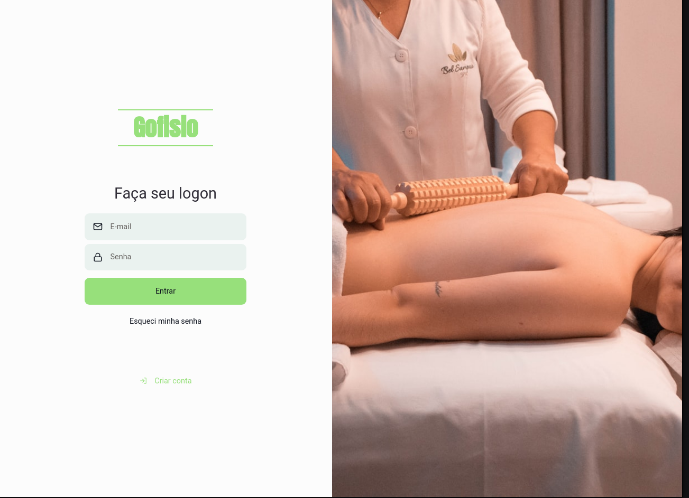

<h1>Projeto-GoFisio</h1>

<h1>Apresentação do projeto</h1>

Projeto ainda em desenvolvimento

<h1>Como utilizar esse projeto ?</h1>

Para utilizar esse projeto na sua maquina, clone esse repósitorio no seu terminal com o comando git clone mas o link desse projeto, depois de clonado der
um comando yarn para a instalação de todas as dependências necessárias e execute o comando yarn start no terminal e a aplicação será aberta no navegador.

OBS: Esse projeto possui um Back End separado, para utiliza-lo corretamente va em outro repósitorio chamado Relacionamento dos models

